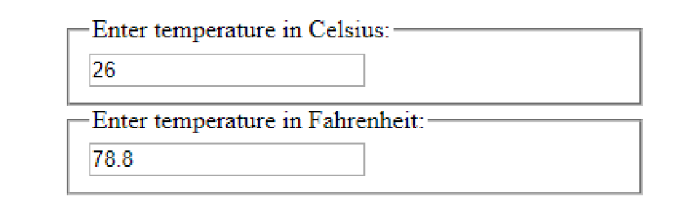

## State Lab

* Create Calculator component that contains 2 Temperature Input
(for inputting temperature in degrees Celsius or Fahrenheit) as
shown below:

* When a user enters a value in either of the two TemperatureInput, the
value in the other TemperatureInput should automatically change.

